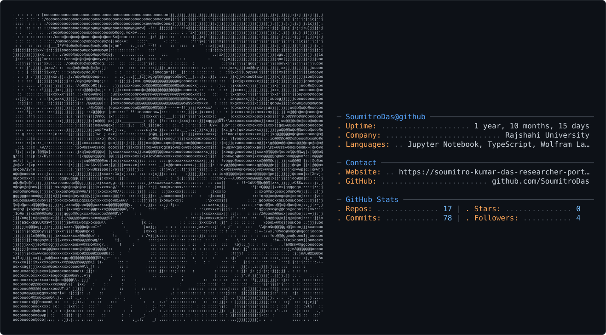

<!-- Soumitro Kumar Das - Vibrant GitHub README -->

<h1 align="center">🌟 Hey there! I'm Soumitro Kumar Das</h1>

<picture>
  <source media="(prefers-color-scheme: dark)" srcset="dark_mode.svg" />
  <source media="(prefers-color-scheme: light)" srcset="light_mode.svg" />
  
</picture>

🎓 <strong>Applied Mathematician</strong> | 🧬 Interdisciplinary Researcher | 💻 Code Explorer  
 📍 M.Sc. in Applied Mathematics, <em>Rajshahi University</em>  
 🌍 Passionate about blending <strong>Math + Code + Communication</strong> to solve complex global problems

---
## 🚀 Snapshot of What I Do

- 📊 Model **vector-borne epidemics** using Python, MATLAB, and Mathematica  
- 📌 Research interests: **Reaction-Diffusion Systems**, **Waste-Aware Epidemics**, **Lyapunov Stability**  
- 🤖 Dive deep into **LLMs**, **AI automation**, and **Generative AI** — including prompt engineering  
- 🧠 Self-taught coder + problem-solver + communicator — from **scientific computing** to **AI ethics**

---

## 💼 Tools in My Arsenal

- 🔹 **Certified C1 English Communicator** — *British Council*  
- 📊 **Business Analytics**: Tableau | SPSS | Power BI | Excel  
- 💾 **Data Science Stack**: SQL | Pandas | NumPy  
- 🧮 **Languages**: Python | MATLAB | Fortran | C/C++ | Mathematica  
- 🗃️ **Others**: Git | LaTeX | Zotero | Overleaf | NVivo

---

## 🌐 GitHub Vibes

- 🔭 **Currently working on**:  
  `→ A reaction-diffusion epidemic model integrating waste management & public awareness.`

- 🌱 **Currently learning**:  
  `→ Prompt engineering, generative AI, and AI-augmented scientific modeling.`

- 👯 **Looking to collaborate on**:  
  `→ Open-source modeling projects, LLM research, or education-tech ideas.`

- 🤔 **Need help with**:  
  `→ Model simulation scaling, efficient dataset generation for multilingual AI.`

- 💬 **Ask me about**:  
  `→ Math modeling, scientific writing, SPSS/Tableau, debate strategy, or the bamboo flute 🎶`

- ⚡ **Fun fact**:  
  `→ I once wrote and debugged code during a blackout on a borrowed laptop — passion always finds a way!`

---

## 🌍 Beyond Academia

- 🏆 **Top Breaking Adjudicator** – Bicol University, Philippines  
- 🎤 Represented 🇧🇩 Bangladesh in **international debates** (English & Bangla)  
- 🧑‍🏫 Mentored 100+ students in debate, communication & research  
- 🎶 I play the **bamboo flute**, practice **Taekwondo**, and simplify chaos with math  
- 📢 I believe: “The best math is the kind you can explain to a stranger on a bus.”

---

## 📫 Let’s Connect!

  📧 <strong>Email:</strong> sdasshuvro@gmail.com &nbsp; | &nbsp; 📱 <strong>Phone:</strong> +8801614556530  
   
  🔗 <a href="https://www.linkedin.com/in/soumitro-kumar-das"><strong>LinkedIn</strong></a> &nbsp; | &nbsp; 🔬 Google Scholar (coming soon!)

---

## ✨ Outro Note

> _"Math is not just numbers; it's a language. And I write code to make that language speak to the world."_

⭐️ Thanks for stopping by!  
Let’s connect, build, and explore — equations, ideas, and intelligent machines 🌐⚙️
